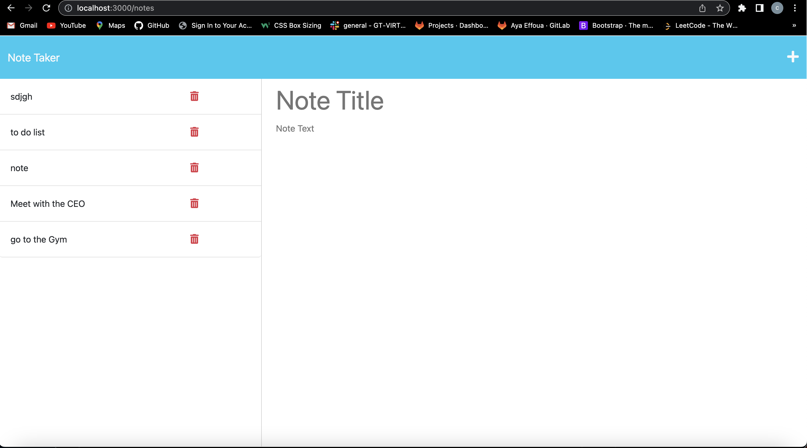
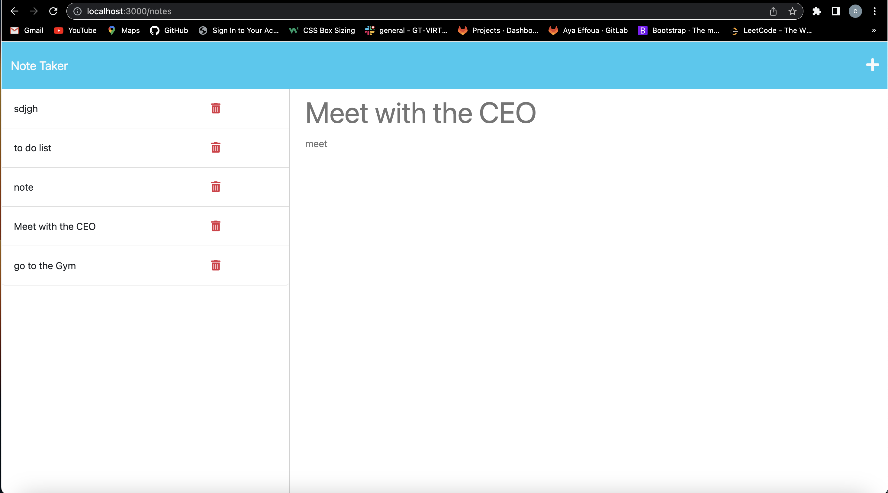

# Prework Study Guide Webpage

## Description
This application is a Note Taker that can be used to write and save notes. It is based on Express.JS.

This app is deployed on Heroku. Please click on the link below to view the app. 
https://express-js-nt.herokuapp.com/notes

## Installation

Run this code in the command line to install the package
npm i

## Usage

Once you have installed the package , run the following code in command line :
node server.js

Once the server is running, go to your webpage and search "localhost:3000" It will run the server where you can find the page on localhost:3001. To end your server in your terminal type: control + c

click on the link below to view a walkthough video of the installation and usage of the app
https://drive.google.com/file/d/10Xz8ZvwbzqyTxBZ62PNTMAxvZAT5vU2v/view

## Screenshot

## License

Please refer to the LICENSE in the repo.